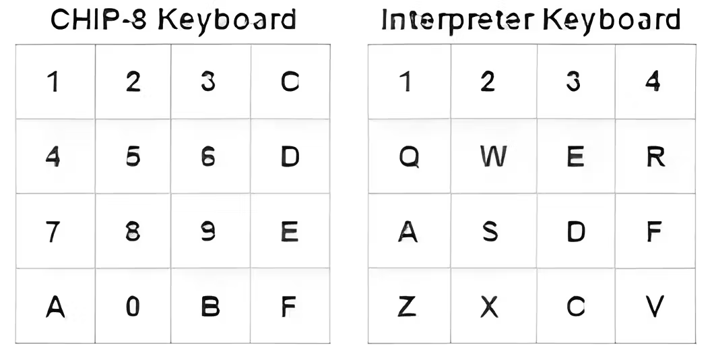

# Chip-8-Interpreter-py

Writing a chip-8 emulator to expand my horizons in computer architecture.

This project is a WIP.

Graphics, sound, and key inputs are processed using SDL2.

## Chip8 Key Mapping


## Memory Map
```
+---------------+= 0xFFF (4095) End of Chip-8 RAM
|               |
|               |
|               |
|               |
|               |
| 0x200 to 0xFFF|
|     Chip-8    |
| Program / Data|
|     Space     |
|               |
|               |
|               |
+- - - - - - - -+= 0x600 (1536) Start of ETI 660 Chip-8 programs
|               |
|               |
|               |
+---------------+= 0x200 (512) Start of most Chip-8 programs
| 0x000 to 0x1FF|
| Reserved for  |
|  interpreter  |
+---------------+= 0x000 (0) Start of Chip-8 RAM
```

## Resources:
- https://tobiasvl.github.io/blog/write-a-chip-8-emulator/ (Primary Source)
- http://devernay.free.fr/hacks/chip8/C8TECH10.HTM
- https://austinmorlan.com/posts/chip8_emulator/ 